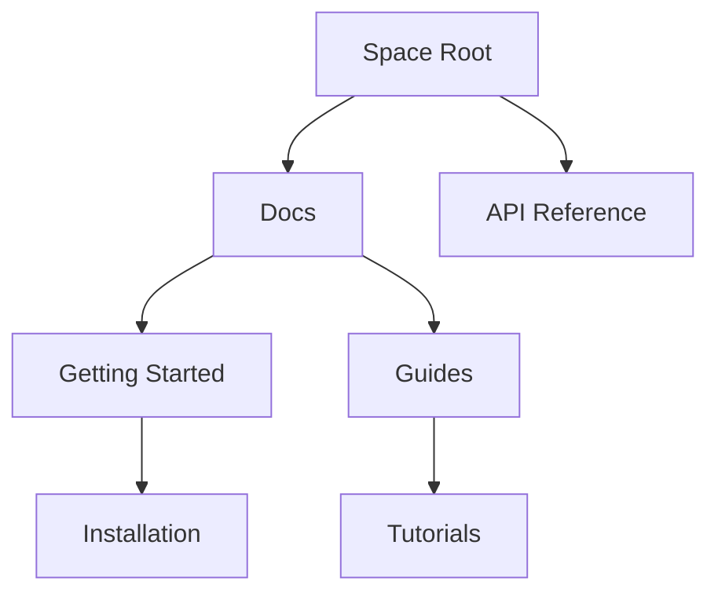

## Overview

Rio provides powerful tools to organize, collaborate on, search, and customize your documentation spaces. You streamline project knowledge management with intuitive hierarchies, real-time collaboration, advanced search, and flexible customization.

<Columns cols={3}>
  <Card title="Document Organization" icon="folder" href="#document-organization">
    Build intuitive hierarchies for your docs.
  </Card>
  <Card title="Collaboration" icon="users" href="#collaboration">
    Work together with version control.
  </Card>
  <Card title="Search & Filtering" icon="search" href="#search">
    Find content instantly.
  </Card>
</Columns>

## Document Organization and Hierarchy

You create structured documentation spaces using nested folders and pages. Rio supports unlimited hierarchy levels, making it easy to mirror your project's structure.



<Steps>
  <Step title="Create a Folder" icon="folder-plus">
    Navigate to your space root and select `New Folder`. Name it descriptively, like `User Guides`.
  </Step>
  <Step title="Add Pages" icon="file-plus">
    Inside the folder, create pages with `New Page`. Use markdown or MDX for rich content.
  </Step>
  <Step title="Reorder Hierarchy" icon="move">
    Drag and drop to adjust order or nesting.
  </Step>
</Steps>

<Callout kind="tip">
  Use consistent naming conventions like `verb-noun` for predictability.
</Callout>

## Collaboration and Version Control

Invite team members to collaborate in real-time. Rio tracks changes with git-like version history, so you revert or compare anytime.

<Tabs>
  <Tab title="Invite Collaborators" icon="user-plus">
    Go to space settings > Members > Add email. Assign roles: Admin, Editor, Viewer.
  </Tab>
  <Tab title="Version History" icon="git-branch">
    Click page history icon. View diffs, restore versions, or branch for experiments.
  </Tab>
</Tabs>

<CodeGroup tabs="CLI,API">
  ```bash
  rio space invite user@example.com --role editor
  rio page history view --page-id 123
  ```
  ```javascript
  await rio.spaces.invite('space-id', 'user@example.com', 'editor');
  const history = await rio.pages.history('page-id');
  ```
</CodeGroup>

## Search and Filtering Functionalities

Rio's search scans full-text across spaces. Filter by tags, authors, dates, or custom metadata for precise results.

| Filter Type | Example Query | Use Case |
|-------------|---------------|----------|
| Tags | `tag:api` | API docs only |
| Author | `author:alice` | Alice's contributions |
| Date | `date:>2024-01-01` | Recent updates |
| Path | `path:guides/*` | All guides |

<Callout kind="info">
  Pro tip: Pin frequent searches to your dashboard for quick access.
</Callout>

## Customization Options for Spaces

Tailor spaces with themes, layouts, and permissions. Use YAML frontmatter for page-level customizations.

<Expandable title="Advanced YAML Config" default-open="false">
  Customize pages with frontmatter:

````yaml
---
title: Custom Page
layout: docs
sidebar: true
theme: dark
tags: [feature, guide]
---
````

</Expandable>

<Tabs>
  <Tab title="Theme Switcher" icon="palette">
    Space settings > Appearance > Select `Light`, `Dark`, or `Auto`.
  </Tab>
  <Tab title="Custom Sidebar" icon="sidebar">
    Enable custom links in space config. Add anchors like `#features`.
  </Tab>
</Tabs>

<Columns cols={2}>
  <Card title="Next: Quickstart" icon="rocket" href="/quickstart">
    Set up your first space.
  </Card>
  <Card title="API Reference" icon="code" href="/api">
    Integrate programmatically.
  </Card>
</Columns>